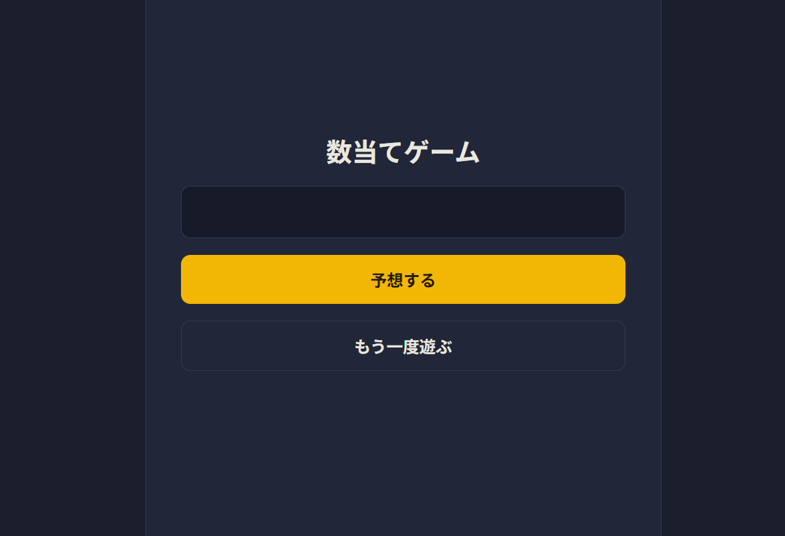
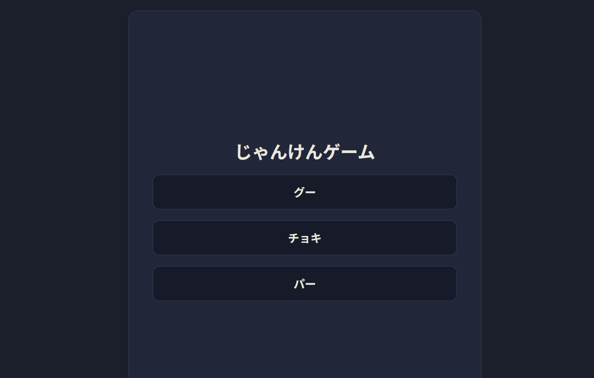
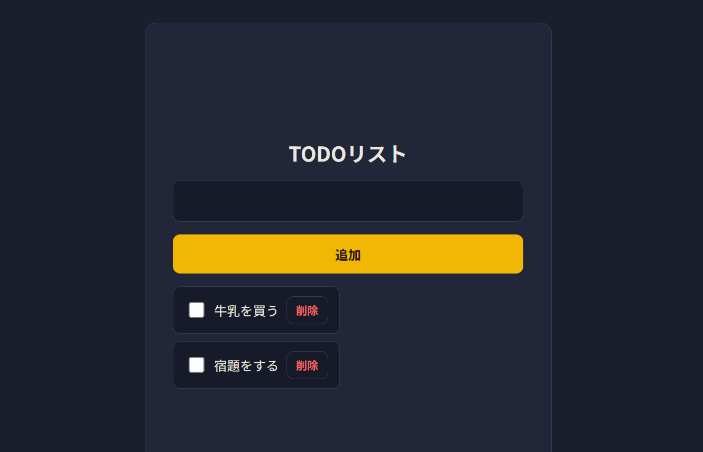
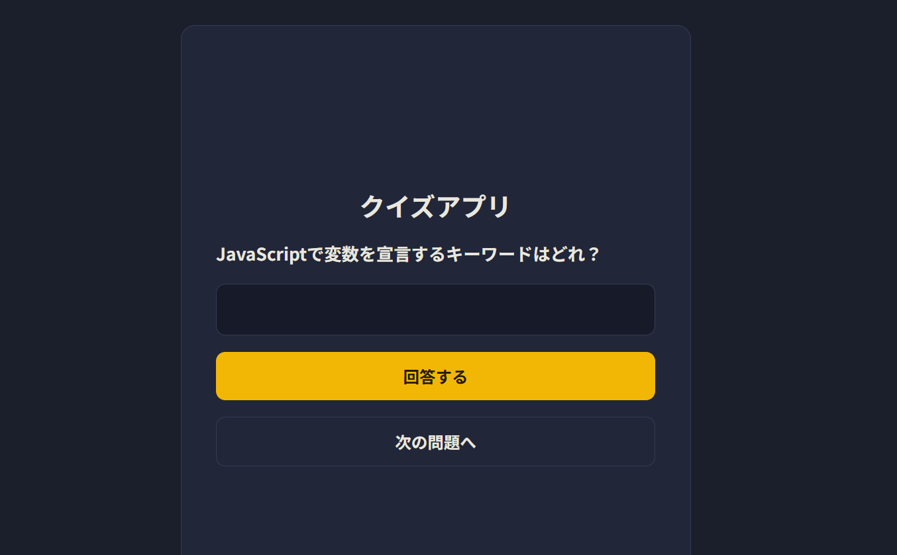
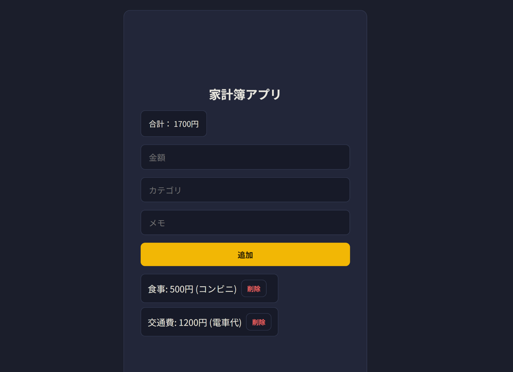
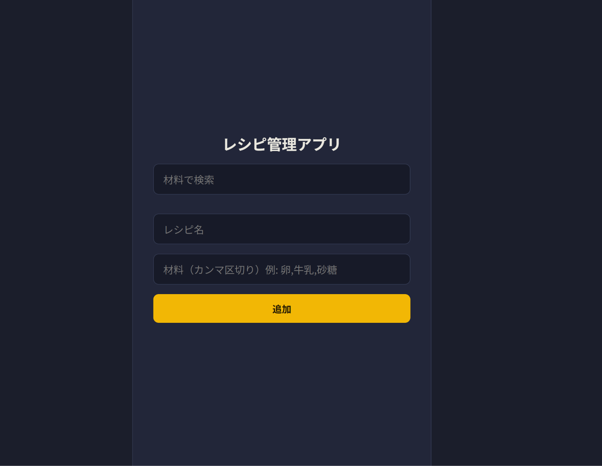

# JavaScript 基礎 練習アプリ集

変数・データ型・演算子・条件分岐・ループ・関数・配列・オブジェクトという
JavaScript基礎8項目を、実際に手を動かして定着させるための学習リポジトリです。

各フォルダに1つの完成アプリ（`index.html` + `script.js`）が入っています。
`index.html`をブラウザで開けばそのまま動きます。

見た目は全アプリ共通の `style.css`（ルート直下）を読み込んでいます。

## 収録アプリ

| #   | フォルダ                                   | アプリ           | 主に使った基礎知識                         |
| --- | ------------------------------------------ | ---------------- | ------------------------------------------ |
| 1   | [01-number-guessing](./01-number-guessing) | 数当てゲーム     | 変数, 関数, 条件分岐                       |
| 2   | [02-janken](./02-janken)                   | じゃんけんゲーム | 配列, 条件分岐, 関数                       |
| 3   | [03-todo](./03-todo)                       | Todoリスト       | 配列操作(push/filter), オブジェクト        |
| 4   | [04-quiz](./04-quiz)                       | クイズアプリ     | オブジェクト配列, ループ, 関数, スコア管理 |
| 5   | [05-kakeibo](./05-kakeibo)                 | 家計簿アプリ     | オブジェクト配列, reduce, filter           |
| 6   | [06-recipe](./06-recipe)                   | レシピ管理アプリ | ネストした配列, 2重ループ, split, includes |

## 各アプリの機能

<table>
  <tr>
    <td width="50%" valign="top">
      <h3>01. 数当てゲーム</h3>
      
      <ul>
        <li>1〜100のランダムな正解を生成</li>
        <li>予想を入力して判定（大きい/小さい/正解）</li>
        <li>試行回数のカウント</li>
        <li>正解後の入力ロック</li>
        <li>再挑戦（リスタート）機能</li>
      </ul>
    </td>
    <td width="50%" valign="top">
      <h3>02. じゃんけんゲーム</h3>
      
      <ul>
        <li>グー・チョキ・パーを配列で管理</li>
        <li>コンピューターの手をランダムに選択</li>
        <li>勝敗判定ロジック（あいこ／勝ち／負け）</li>
      </ul>
    </td>
  </tr>
  <tr>
    <td width="50%" valign="top">
      <h3>03. Todoリスト</h3>
      
      <ul>
        <li>タスクの追加・一覧表示</li>
        <li>タスクの削除（filterで対象以外を残す）</li>
        <li>完了チェック（オブジェクトのdoneプロパティを更新）</li>
      </ul>
    </td>
    <td width="50%" valign="top">
      <h3>04. クイズアプリ</h3>
      
      <ul>
        <li>問題データをオブジェクトの配列で管理</li>
        <li>問題を順番に出題（currentIndexで管理）</li>
        <li>回答の正誤判定</li>
        <li>全問終了後にスコアを表示</li>
      </ul>
    </td>
  </tr>
  <tr>
    <td width="50%" valign="top">
      <h3>05. 家計簿アプリ</h3>
      
      <ul>
        <li>支出（金額・カテゴリ・メモ）を追加・一覧表示</li>
        <li>支出の削除（filterで対象以外を残す）</li>
        <li>合計金額を自動計算・表示（reduce）</li>
      </ul>
    </td>
    <td width="50%" valign="top">
      <h3>06. レシピ管理アプリ</h3>
      
      <ul>
        <li>レシピ名と材料（ネストした配列）を追加・一覧表示</li>
        <li>材料入力をカンマ区切りから配列に変換（split）</li>
        <li>レシピの削除</li>
        <li>材料でのレシピ検索・絞り込み（filter + includes）</li>
      </ul>
    </td>
  </tr>
</table>

## 開発の進め方

各アプリは `feature/アプリ名` のブランチを切って実装し、完成したら
Pull Requestを作成して`main`にマージする、という流れで進めました。

```bash
git switch -c feature/新しいアプリ名
# 実装 → コミット → push
git push -u origin feature/新しいアプリ名
# GitHub上でPRを作成してマージ
git switch main
git pull
git branch -d feature/新しいアプリ名
```

## 学んだ基礎知識まとめ

| トピック                             | 主に使ったアプリ                     |
| ------------------------------------ | ------------------------------------ |
| 変数（let / const）                  | 全アプリ                             |
| データ型・typeof                     | 数当てゲーム                         |
| 演算子（算術・比較）                 | 数当てゲーム                         |
| 条件分岐（if / else if / else）      | 数当てゲーム, じゃんけん             |
| ループ（for）                        | Todoリスト（表示処理）               |
| 関数（function, return）             | 全アプリ                             |
| 配列（push, filter, forEach）        | じゃんけん, Todoリスト               |
| オブジェクト（プロパティ, メソッド） | Todoリスト, クイズアプリ             |
| アロー関数                           | 家計簿, レシピ（一部）               |
| 分割代入・スプレッド構文             | （モダンJS学習時に練習）             |
| map / reduce                         | 家計簿アプリ（合計金額の計算）       |
| split / includes                     | レシピ管理アプリ（材料の変換・検索） |
| ネストしたデータ構造・2重ループ      | レシピ管理アプリ                     |
